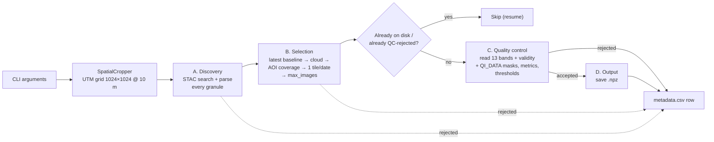

# Sentinel-2 L1C Time-Series Pipeline

A command-line pipeline that queries, downloads, quality-controls and preprocesses **Sentinel-2 Level-1C**
imagery from the [Copernicus Data Space Ecosystem (CDSE)](https://dataspace.copernicus.eu/).

Given a point (latitude, longitude) and a date range, it builds a **pixel-aligned time series** of
13-band image tensors: each accepted acquisition is stored as a `uint16` array of shape
**(13, 1024, 1024)** at 10 m resolution, on the same local UTM grid for every date, together with
per-band pixel validity masks. Every granule returned by the catalogue, whether saved or not, is
documented in `metadata.csv` with the stage and reason of the decision.

---

## Table of contents

- [Features](#features)
- [How it works](#how-it-works)
- [Installation](#installation)
- [CDSE credentials](#cdse-credentials)
- [Usage](#usage)
- [Command-line reference](#command-line-reference)
- [Output format](#output-format)
- [Method details](#method-details)
- [Validation](#validation)
- [Limitations](#limitations)
- [Project structure](#project-structure)

---

## Features

- **Four separate stages**: discovery → selection → quality control → output.
- **Catalogue search** through the CDSE STAC API (collection `sentinel-2-l1c`) with automatic pagination.
  Cloud cover is filtered client-side, so cloudy scenes are recorded as rejected instead of disappearing.
- **Two data access modes**
  - `s3`: windowed streaming reads directly from the CDSE object store via GDAL (`/vsis3/`), so only
    the pixels covering the area of interest are decoded;
  - `https`: per-band download through the OData API with OAuth2 authentication (token refresh,
    cross-host redirects, retries and truncation checks handled).
- **Distortion-free framing**: a 10.24 km × 10.24 km area of interest (1024 × 1024 px at 10 m) in the
  local UTM zone.
- **Strict geometric alignment** across all dates: one fixed grid snapped to the Sentinel-2 pixel lattice.
- **All 13 bands**: 10 m bands copied pixel-for-pixel, 20 m and 60 m bands bilinearly resampled to 10 m.
- **Per-band pixel validity**: raster mask, declared nodata, the `0` fallback, raster extent, resampling
  support and the ESA detector-footprint / quality masks. A pixel is never valid because another band is.
- **Pixel quality control** with configurable thresholds: valid fraction, AOI border nodata, saturation,
  sensor artefacts and cloud / cirrus fraction from the L1C `QI_DATA` masks.
- **Smart scene selection**: removes reprocessing duplicates, picks one granule per date when tiles
  overlap, and supports "first N" or "N clearest" sampling.
- **Resumable**: saved dates and acquisitions already rejected by quality control (with the same
  thresholds) are not read again; failed dates are retried. Files are written atomically.
- **Traceable metadata** (`metadata.csv`): one row per granule, with status, stage, machine-readable
  rejection reasons, STAC acquisition metadata and all quality metrics.
- **Optional radiometric harmonisation** of the +1000 DN offset introduced by processing baseline 04.00.

---

## How it works



The code is organised in three classes:

| Class | Responsibility |
|---|---|
| `CDSEClient` | STAC search, authentication (S3 keys or OAuth2 token), band / mask access over S3 or HTTPS/OData |
| `SpatialCropper` | Defines the UTM target grid, computes the geometric AOI coverage, reads bands (with validity) and categorical masks onto the grid |
| `PipelineRunner` | `discover` → `select` → `process` + `quality_control` → `_save`, resume logic, `metadata.csv` |

---

## Installation

Tested with Python 3.10+ on Linux (Ubuntu) and Windows. The `rasterio` wheels ship with GDAL and the
JPEG2000 (OpenJPEG) driver required to read Sentinel-2 bands.

### Option 1: pip + venv

```bash
python3 -m venv ~/.venvs/s2
source ~/.venvs/s2/bin/activate
pip install --upgrade pip
pip install -r requirements.txt
```

### Option 2: conda

```bash
conda create -n s2 -c conda-forge python=3.11 pystac-client rasterio shapely pyproj numpy requests python-dotenv
conda activate s2
```

### Dependencies

`pystac-client`, `rasterio`, `shapely`, `pyproj`, `numpy`, `requests`, `python-dotenv`
(see [`requirements.txt`](requirements.txt)).

---

## CDSE credentials

Searching the catalogue is anonymous, but reading the imagery requires a free CDSE account
([register here](https://dataspace.copernicus.eu/)). Credentials are read from environment variables
(or a local `.env` file), never from the command line.

| Access mode | Environment variables | How to obtain |
|---|---|---|
| `s3` (recommended) | `CDSE_S3_ACCESS_KEY`, `CDSE_S3_SECRET_KEY` | Generate keys at <https://eodata-s3keysmanager.dataspace.copernicus.eu> |
| `https` | `CDSE_USERNAME`, `CDSE_PASSWORD` | Your CDSE account login |

```bash
export CDSE_S3_ACCESS_KEY="your_access_key"
export CDSE_S3_SECRET_KEY="your_secret_key"
```

With `--access auto` (the default), `s3` is used when both S3 keys are set, `https` otherwise.

---

## Usage

### 1. Preview the selection (no download, no credentials needed)

```bash
python s2_l1c_pipeline.py --lat 48.8566 --lon 2.3522 \
    --start_date 2023-01-01 --end_date 2023-12-31 \
    --max_cloud 20 --output_dir ./data/paris_2023 --dry_run
```

Example output (rejection counts per stage and reason are logged before the table):

```text
date        tile   cloud%  cover  base        crs  item_id
2023-02-07  31UDQ    0.00  1.000  5.10 EPSG:32631  S2A_MSIL1C_20230207T110221_N0510_R094_T31UDQ_20240812T144041
2023-02-14  31UDQ    0.00  1.000  5.10 EPSG:32631  S2A_MSIL1C_20230214T105141_N0510_R051_T31UDQ_20240815T185133
...
```

### 2. Full download of one location over one year

```bash
python s2_l1c_pipeline.py --lat 48.8566 --lon 2.3522 \
    --start_date 2023-01-01 --end_date 2023-12-31 \
    --output_dir ./data/paris_2023
```

### 3. Capped download: the 20 clearest images between two dates

```bash
python s2_l1c_pipeline.py --lat 43.6047 --lon 1.4442 \
    --start_date 2020-01-01 --end_date 2024-12-31 \
    --max_cloud 20 --max_images 20 --sort cloud \
    --output_dir ./data/toulouse_top20
```

### 4. Strict research quality control

```bash
python s2_l1c_pipeline.py --lat 48.8566 --lon 2.3522 \
    --start_date 2023-01-01 --end_date 2023-12-31 --max_cloud 30 \
    --min_valid_fraction 0.999 --max_cloud_fraction 0.05 --max_artefact_fraction 0.01 \
    --require_quality_masks --output_dir ./data/paris_2023_strict
```

### 5. Resume after an interruption

Run the **same command** again: saved dates are skipped, acquisitions already rejected by quality
control with the same thresholds are not downloaded again, and failed dates are retried. Changing a
quality-control threshold re-evaluates previously rejected acquisitions.

### 6. Load the data

```python
import numpy as np

z = np.load("data/paris_2023/2023-06-07_31UDQ.npz")
cube = z["data"]              # (13, 1024, 1024) uint16
bands = z["bands"].tolist()   # ['B01', 'B02', ..., 'B12']
valid = z["valid_mask"]       # (13, 1024, 1024) bool, per band
rgb = cube[[bands.index("B04"), bands.index("B03"), bands.index("B02")]]
rgb_valid = valid[[bands.index("B04"), bands.index("B03"), bands.index("B02")]].all(axis=0)
```

```python
import pandas as pd

meta = pd.read_csv("data/paris_2023/metadata.csv")
meta.groupby(["status", "stage"]).size()
meta[meta.status == "rejected"].rejection_reason.str.split(";").explode().str.split(":").str[0].value_counts()
```

---

## Command-line reference

| Argument | Default | Description |
|---|---|---|
| **Query / selection** | | |
| `--lat` | *required* | AOI centre latitude (WGS84) |
| `--lon` | *required* | AOI centre longitude (WGS84) |
| `--start_date` | `2015-06-23` | First day, inclusive (`YYYY-MM-DD`) |
| `--end_date` | `2026-08-31` | Last day, inclusive (`YYYY-MM-DD`) |
| `--max_images` | all | Maximum number of acquisition dates. Dates already on disk count toward the cap |
| `--max_cloud` | `100` | Maximum granule cloud cover (%) |
| `--sort` | `date` | How `--max_images` picks dates: `date` (earliest first) or `cloud` (clearest first) |
| `--min_coverage` | `0.99` | Minimum fraction of the AOI inside the granule's STAC footprint (geometry only) |
| **Quality control** | | |
| `--min_valid_fraction` | `0.99` | Minimum fraction of AOI pixels valid in **all 13** bands |
| `--max_edge_nodata_fraction` | `0.20` | Maximum fraction of the AOI border ring that is nodata in any band |
| `--edge_width` | `32` | Width of that border ring, in pixels |
| `--max_saturated_fraction` | `0.01` | Maximum fraction of valid band samples that are saturated |
| `--max_artefact_fraction` | `0.05` | Maximum fraction of valid band samples flagged defective / degraded by `MSK_QUALIT` (ignored if unavailable) |
| `--max_cloud_fraction` | `1.0` | Maximum fraction of observed pixels flagged opaque cloud or cirrus by `MSK_CLASSI` (ignored if unavailable) |
| `--require_quality_masks` | off | Reject acquisitions whose `QI_DATA` masks could not all be read |
| **Output / processing** | | |
| `--output_dir` | *required* | Directory for `.npz` files and `metadata.csv` |
| `--harmonize` | off | Subtract the +1000 DN offset for processing baseline ≥ 04.00 (after quality control) |
| `--dry_run` | off | List the selected acquisitions and exit (writes nothing) |
| **Access / runtime** | | |
| `--access` | `auto` | `auto`, `s3` or `https` |
| `--workers` | `4` | Bands read in parallel per acquisition |
| `--retries` | `3` | Attempts per band / mask read |
| `--stac_url` | CDSE STAC v1 | STAC API endpoint |
| `--collection` | `sentinel-2-l1c` | STAC collection |
| `--log_level` | `INFO` | `DEBUG`, `INFO`, `WARNING`, `ERROR` |

**Exit codes:** `0` success · `1` finished with some failed dates · `2` fatal error · `130` interrupted.

---

## Output format

```text
output_dir/
├── metadata.csv
├── 2023-02-07_31UDQ.npz
├── 2023-02-14_31UDQ.npz
└── ...
```

### Arrays: `<YYYY-MM-DD>_<tile_id>.npz`

Only acquisitions accepted by quality control are written.

| Key | Content |
|---|---|
| `data` | `uint16` array, shape `(13, 1024, 1024)`; `0` wherever `valid_mask` is false |
| `valid_mask` | `bool`, shape `(13, 1024, 1024)`: trustworthy sample, per band |
| `nodata_mask` | `bool`, shape `(13, 1024, 1024)`: no source sample at all, per band |
| `valid_any` | `bool`, `(1024, 1024)`: valid in at least one band |
| `valid_all` | `bool`, `(1024, 1024)`: valid in all 13 bands |
| `quality_bits` | `uint8`, `(13, 1024, 1024)`, bit *i* = `quality_bit_names[i]` (from `MSK_QUALIT`; only if read) |
| `quality_bit_names` | `ancillary_lost, ancillary_degraded, msi_lost, msi_degraded, defective, nodata, crosstalk_partially_corrected, saturated_l1a` |
| `classification_mask` | `uint8`, `(3, 1024, 1024)` from `MSK_CLASSI` (only if read) |
| `classification_names` | `opaque_cloud, cirrus, snow_ice` |
| `bands` | Band order: `B01, B02, B03, B04, B05, B06, B07, B08, B8A, B09, B10, B11, B12` |
| `transform` | Affine geotransform `(a, b, c, d, e, f)` of the grid, in metres |
| `crs` | Grid CRS, e.g. `EPSG:32631` |

`transform` and `crs` make every array georeferenced (e.g. exportable to GeoTIFF with rasterio).
With `--harmonize`, valid samples below 1000 DN become `0`: always use `valid_mask`, not `data == 0`,
to identify missing data.

### `metadata.csv`

One row per STAC granule (keyed by `item_id`). Per-band values are JSON objects keyed by band name;
fractions are rounded to 6 decimals; an empty cell means "not computed / not available".

| Column | Description |
|---|---|
| `filename` | Output file name (`saved`), or the existing file (`skipped`) |
| `date` | Acquisition date (UTC) |
| `tile_id` | MGRS tile, e.g. `31UDQ` |
| `cloud_cover` | Granule cloud cover (%) from STAC |
| `item_id` | STAC item / product identifier |
| `datetime_utc` | Exact sensing time |
| `platform` | `sentinel-2a`, `sentinel-2b` or `sentinel-2c` |
| `processing_baseline` | ESA processing baseline, e.g. `5.10` |
| `source_crs` | CRS of the source tile |
| `aoi_coverage` | Fraction of the AOI inside the granule's STAC footprint (**geometry, not pixel validity**) |
| `status` | `saved`, `rejected`, `failed`, `skipped` (or `selected` while a run is in progress / was interrupted) |
| `stage` | `discovery`, `selection`, `quality_control` or `output`: where the decision was taken |
| `rejection_reason` | `;`-separated reasons, each `code` or `code:detail` (see below); exception text for `failed` |
| `relative_orbit`, `orbit_state` | Relative orbit number, ascending / descending |
| `sun_elevation`, `sun_azimuth`, `view_incidence_angle` | Acquisition geometry (degrees) |
| `datatake_id`, `processing_datetime` | Datatake identifier and processing time |
| `valid_fraction_any_band` | Fraction of AOI pixels valid in at least one band |
| `valid_fraction_all_bands` | Fraction of AOI pixels valid in all 13 bands |
| `valid_fraction_by_band` | JSON: valid fraction per band |
| `nodata_fraction_by_band` | JSON: nodata fraction per band |
| `edge_nodata_fraction` | Fraction of the `--edge_width` border ring that is nodata in any band |
| `per_band_min`, `per_band_max` | JSON: raw DN extrema over valid samples |
| `per_band_p02`, `per_band_p50`, `per_band_p98` | JSON: robust raw DN percentiles over valid samples |
| `cloud_fraction` | Opaque cloud or cirrus, over pixels valid in at least one band (`MSK_CLASSI`) |
| `opaque_cloud_fraction`, `cirrus_fraction`, `snow_ice_fraction` | Individual `MSK_CLASSI` layers |
| `shadow_fraction` | Always empty: L1C products contain no cloud-shadow mask |
| `artefact_fraction` | Valid samples flagged ancillary lost/degraded, MSI degraded or defective (`MSK_QUALIT`) |
| `saturation_fraction` | Valid samples with DN 65535 or the L1A saturation flag |
| `saturation_fraction_by_band` | JSON: same, per band |
| `quality_flag_fractions` | JSON: fraction of samples raising each `MSK_QUALIT` flag |
| `mask_source_by_band` | JSON: validity sources applied per band, e.g. `fallback_nodata_0+MSK_DETFOO+MSK_QUALIT` |
| `quality_assets` | Quality mask families expected for the product (`MSK_CLASSI,MSK_DETFOO,MSK_QUALIT`) |
| `quality_mask_status` | `available` (all 27 masks read), `partial` or `unavailable` |
| `qc_config` | JSON of the quality-control thresholds used for this decision |
| `harmonized` | `1` if the +1000 DN offset was removed from the saved file |
| `stac_properties` | JSON of all STAC item properties (access-related keys removed) |

#### Rejection reasons

| Stage | Code | Meaning |
|---|---|---|
| `discovery` | `missing_band_assets:<bands>` | STAC item lacks some of the 13 band assets |
| `discovery` | `tile_id_not_found`, `datetime_not_found`, `parse_error:…` | Item could not be parsed |
| `selection` | `older_processing_baseline:<kept item>` | Same tile and day exists with a more recent baseline |
| `selection` | `scene_cloud_cover_above_threshold` | `eo:cloud_cover` > `--max_cloud` |
| `selection` | `aoi_coverage_below_threshold` | STAC footprint covers < `--min_coverage` of the AOI |
| `selection` | `inferior_overlapping_tile:<kept item>` | Another tile was preferred for that date |
| `selection` | `max_images_limit` | Beyond `--max_images` |
| `quality_control` | `no_valid_pixels` | No valid pixel in any band |
| `quality_control` | `valid_fraction_all_bands_below_threshold` | < `--min_valid_fraction` |
| `quality_control` | `edge_nodata_fraction_above_threshold` | > `--max_edge_nodata_fraction` |
| `quality_control` | `saturation_fraction_above_threshold` | > `--max_saturated_fraction` |
| `quality_control` | `artefact_fraction_above_threshold` | > `--max_artefact_fraction` |
| `quality_control` | `pixel_cloud_fraction_above_threshold` | > `--max_cloud_fraction` |
| `quality_control` | `quality_masks_unavailable`, `quality_masks_partial` | With `--require_quality_masks` |
| `output` | `output_exists_for_date:<file>` (status `skipped`) | A file for that date already exists from another granule / an older run |

---

## Method details

### Target grid

1. The UTM zone is derived from the longitude (`EPSG:326xx` north, `EPSG:327xx` south).
2. The centre point is projected to UTM, and a 1024 × 1024 px square at 10 m is built around it.
3. The upper-left corner is **snapped to a multiple of 60 m**. Sentinel-2 tile origins are multiples of
   60 m, so the grid lies on the 10 m, 20 m and 60 m pixel lattices simultaneously. As a result, the grid
   centre can move by a few tens of metres from the requested point (logged at start-up).
4. The same grid is reused for every date, which guarantees pixel-to-pixel alignment of the time series.

### Band resampling

| Native resolution | Bands | Processing |
|---|---|---|
| 10 m | B02, B03, B04, B08 | Copied 1:1 (nearest neighbour on an aligned grid) |
| 20 m | B05, B06, B07, B8A, B11, B12 | Bilinear interpolation to 10 m |
| 60 m | B01, B09, B10 | Bilinear interpolation to 10 m |

For each band, only the source window covering the AOI (plus a 2-pixel margin for the interpolation
kernel) is read, then warped onto the target grid with `rasterio.warp.reproject`. If the selected tile is
in a neighbouring UTM zone, it is reprojected and the 10 m bands are also resampled bilinearly.
Quality masks are always resampled with nearest neighbour.

### Scene selection

Applied in this order, each discarded granule receiving a reason:

1. **Reprocessing duplicates**: for the same tile and day, the most recent processing baseline is kept.
   This is done first, so the cloud or coverage filters can never fall back to an outdated baseline.
2. **Scene cloud cover** (`--max_cloud`, STAC `eo:cloud_cover`).
3. **Geometric AOI coverage** of the STAC footprint (`--min_coverage`).
4. **Overlapping tiles**: when several tiles remain for a date, the granule is chosen by
   (a) AOI coverage, (b) same UTM zone as the grid, (c) lowest cloud cover.
5. `--max_images` is applied in chronological order or by increasing cloud cover (`--sort`), and the
   selected dates are then processed chronologically.

### Pixel validity

For each band independently, `SpatialCropper.read_band` returns the data, a `valid` mask and a separate
`nodata` mask:

1. the source raster mask (`read_masks()`), when the file declares one;
2. the source nodata value (`src.nodata`), when declared;
3. otherwise `0` as nodata (Sentinel-2 L1C JP2s declare neither, but reserve DN 0);
4. pixels outside the intersection between the AOI and the raster;
5. pixels invalidated by the reprojection: a target pixel is valid only if **every** source sample of
   its resampling kernel is valid (the validity mask is warped with the same kernel and must stay at
   1) and the warped value is not nodata. A 20 m / 60 m pixel next to a hole is therefore *invalid*
   without being *nodata*.

The L1C `QI_DATA` masks then refine each band (see below): pixels outside every detector
(`MSK_DETFOO` = 0) or flagged `msi_lost` / `nodata` by `MSK_QUALIT` become nodata.

### Quality masks

CDSE does not list the L1C quality masks as STAC assets, but every granule with processing baseline
≥ 04.00 (the whole CDSE L1C archive is Collection-1, baseline 05.xx) contains raster masks in
`GRANULE/<granule>/QI_DATA/`. Their paths are derived from the band hrefs:

| File | Layers | Use |
|---|---|---|
| `MSK_CLASSI_B00.jp2` (60 m) | opaque clouds, cirrus, snow/ice | `cloud_fraction`, `opaque_cloud_fraction`, `cirrus_fraction`, `snow_ice_fraction` |
| `MSK_DETFOO_<band>.jp2` (band resolution) | detector index, 0 = none | nodata outside the detector footprint |
| `MSK_QUALIT_<band>.jp2` (band resolution) | 8 flags (see `quality_bit_names`) | nodata (`msi_lost`, `nodata`), `artefact_fraction`, `saturation_fraction` |

`MSK_CLASSI` is read first; if it is unreachable, the per-band masks are not attempted and
`quality_mask_status` is `unavailable`. Missing masks never fail an acquisition unless
`--require_quality_masks` is set. Older baselines only ship GML vector masks, which are not used.

### Quality control

All metrics are computed on raw DN, before `--harmonize`, and only from pixel masks: the STAC
`aoi_coverage` is a selection criterion and never enters the pixel metrics. Saturation and artefact
fractions use valid band samples as denominator; cloud fractions use pixels valid in at least one band.

### Radiometry

Values are L1C top-of-atmosphere reflectance digital numbers. From processing baseline 04.00 onwards
(and for the reprocessed archive), ESA adds an offset of +1000 DN:
`reflectance = (DN - 1000) / 10000`. By default the raw DN are kept and the baseline is logged;
`--harmonize` subtracts the offset in the saved file (values below 1000 are clipped to 0).

### Robustness

- Atomic writes (`.part` temp file, then rename) for arrays and metadata; `metadata.csv` is rewritten
  after every decision.
- HTTP retries with exponential backoff (429 / 5xx), OAuth2 token refresh, manual redirect handling
  (the Authorization header is preserved across CDSE hosts), download size checks.
- A failed date is logged with its exception and skipped without stopping the run; it is retried on the
  next execution.
- A `metadata.csv` written by the previous version of the pipeline is read and migrated (its rows become
  `saved`).

---

## Validation

Run the offline test suite (no network access, no credentials):

```bash
python -m unittest discover -s tests -v
```

It covers:

- **`read_band`**: raster mask + declared nodata, `0` fallback, custom nodata value, pixels outside the
  raster, AOI outside the raster, and a 20 m nodata sample whose bilinear neighbours become invalid but
  not nodata; categorical masks resampled with nearest neighbour.
- **Quality control**: any-band vs all-band validity, per-band fractions and statistics, border nodata,
  saturation on valid raw samples, cloud / artefact fractions from masks, strict mask mode, and the
  integration of `MSK_DETFOO` / `MSK_QUALIT` into the validity masks.
- **Discovery / selection**: derived `QI_DATA` paths, rejected unparseable items, baseline-before-cloud
  ordering, coverage, overlapping tiles and `--max_images` reasons.
- **End-to-end run** with fake STAC items and reads: `saved`, `rejected`, `failed` and `skipped` rows,
  `.npz` content, harmonisation after QC, and idempotent resume.

Checks performed during development against CDSE:

- **Live catalogue query** against the CDSE STAC API (Paris, 2023, cloud ≤ 20 %): search, deduplication,
  coverage filtering and `--sort cloud` selection.
- **`QI_DATA` layout** read on a baseline-05.10 product: `MSK_CLASSI_B00` (3 layers, 60 m),
  `MSK_DETFOO_<band>` and `MSK_QUALIT_<band>` (8 layers) at band resolution; band JP2s declare no nodata
  and no mask.
- **10 m bands**: the output is bit-identical to the corresponding source pixels.
- **20 m / 60 m alignment**: a linear ramp raster (which bilinear interpolation must reproduce exactly)
  gives a maximum error of 0.62 DN, i.e. integer rounding only, so no sub-pixel shift.

---

## Limitations

- **Footprint size**: 1024 px × 10 m = **10.24 km**, slightly more than 10 km, so that the tensor has a
  power-of-two size.
- **Scene cloud cover is per tile**, not per AOI, so `--max_cloud` is an approximation for a 10 km area;
  use `cloud_fraction` / `--max_cloud_fraction` for the AOI itself.
- **L1C cloud masks are coarse** (60 m, ESA on-board-style classification) and **there is no cloud-shadow
  mask** in L1C: `shadow_fraction` stays empty. Use a dedicated cloud / shadow detector for strict
  clear-sky analyses.
- **Quality masks add reads**: 27 small extra files per acquisition (a few tens of KB each).
- **`https` mode is bandwidth-heavy** (full band files, about 0.5–1 GB per acquisition); `s3` mode is
  much faster for long time series.
- UTM zones follow the standard 6° definition (valid for latitudes −80° to 84°); the Norway/Svalbard
  exceptions are not applied.
- When the best tile of a date is rejected by quality control, the next-best overlapping tile is not
  tried automatically.

---

## Project structure

```text
.
├── s2_l1c_pipeline.py   # CLI pipeline (CDSEClient, SpatialCropper, PipelineRunner)
├── tests/               # offline unittest suite (python -m unittest discover -s tests)
├── requirements.txt     # Python dependencies
├── .gitignore
└── README.md
```

---

## Data source

Contains modified Copernicus Sentinel data, provided by the
[Copernicus Data Space Ecosystem](https://dataspace.copernicus.eu/).
