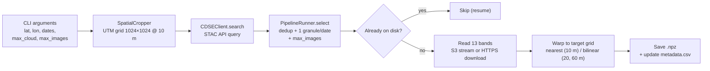

# Sentinel-2 L1C Time-Series Pipeline

A command-line pipeline that queries, downloads and preprocesses **Sentinel-2 Level-1C** imagery from the
[Copernicus Data Space Ecosystem (CDSE)](https://dataspace.copernicus.eu/).

Given a point (latitude, longitude) and a date range, it builds a **pixel-aligned time series** of
13-band image tensors: each acquisition is stored as a `uint16` array of shape **(13, 1024, 1024)** at
10 m resolution, on the same local UTM grid for every date.

---

## Table of contents

- [Features](#features)
- [How it works](#how-it-works)
- [Installation](#installation)
- [CDSE credentials](#cdse-credentials)
- [Usage](#usage)
- [Command-line reference](#command-line-reference)
- [Output format](#output-format)
- [Method details](#method-details)
- [Validation](#validation)
- [Limitations](#limitations)
- [Project structure](#project-structure)

---

## Features

- **Catalogue search** through the CDSE STAC API (collection `sentinel-2-l1c`), with server-side cloud
  filtering (CQL2) and automatic pagination.
- **Two data access modes**
  - `s3`: windowed streaming reads directly from the CDSE object store via GDAL (`/vsis3/`), so only
    the pixels covering the area of interest are decoded;
  - `https`: per-band download through the OData API with OAuth2 authentication (token refresh,
    cross-host redirects, retries and truncation checks handled).
- **Distortion-free framing**: a 10.24 km × 10.24 km area of interest (1024 × 1024 px at 10 m) in the
  local UTM zone.
- **Strict geometric alignment** across all dates: one fixed grid snapped to the Sentinel-2 pixel lattice.
- **All 13 bands**: 10 m bands copied pixel-for-pixel, 20 m and 60 m bands bilinearly resampled to 10 m.
- **Smart scene selection**: removes reprocessing duplicates, picks one granule per date when tiles
  overlap, and supports "first N" or "N clearest" sampling.
- **Resumable**: dates already on disk are skipped; files are written atomically, so an interrupted run
  never leaves corrupted outputs.
- **Metadata log** (`metadata.csv`) for every saved acquisition.
- **Optional radiometric harmonisation** of the +1000 DN offset introduced by processing baseline 04.00.

---

## How it works



The code is organised in three classes:

| Class | Responsibility |
|---|---|
| `CDSEClient` | STAC search, authentication (S3 keys or OAuth2 token), band access over S3 or HTTPS/OData |
| `SpatialCropper` | Defines the UTM target grid, computes AOI coverage, reads and resamples a band onto the grid |
| `PipelineRunner` | Scene selection, resume logic, parallel band reading, saving arrays and metadata |

---

## Installation

Tested with Python 3.10+ on Linux (Ubuntu). The `rasterio` wheels ship with GDAL and the
JPEG2000 (OpenJPEG) driver required to read Sentinel-2 bands.

### Option 1: pip + venv

```bash
python3 -m venv ~/.venvs/s2
source ~/.venvs/s2/bin/activate
pip install --upgrade pip
pip install -r requirements.txt
```

### Option 2: conda

```bash
conda create -n s2 -c conda-forge python=3.11 pystac-client rasterio shapely pyproj numpy requests
conda activate s2
```

### Dependencies

`pystac-client`, `rasterio`, `shapely`, `pyproj`, `numpy`, `requests` (see [`requirements.txt`](requirements.txt)).

---

## CDSE credentials

Searching the catalogue is anonymous, but reading the imagery requires a free CDSE account
([register here](https://dataspace.copernicus.eu/)). Credentials are read from environment variables,
never from the command line.

| Access mode | Environment variables | How to obtain |
|---|---|---|
| `s3` (recommended) | `CDSE_S3_ACCESS_KEY`, `CDSE_S3_SECRET_KEY` | Generate keys at <https://eodata-s3keysmanager.dataspace.copernicus.eu> |
| `https` | `CDSE_USERNAME`, `CDSE_PASSWORD` | Your CDSE account login |

```bash
export CDSE_S3_ACCESS_KEY="your_access_key"
export CDSE_S3_SECRET_KEY="your_secret_key"
```

With `--access auto` (the default), `s3` is used when both S3 keys are set, `https` otherwise.

---

## Usage

### 1. Preview the selection (no download, no credentials needed)

```bash
python s2_l1c_pipeline.py --lat 48.8566 --lon 2.3522 \
    --start_date 2023-01-01 --end_date 2023-12-31 \
    --max_cloud 20 --output_dir ./data/paris_2023 --dry_run
```

Example output:

```text
date        tile   cloud%  cover  base        crs  item_id
2023-02-07  31UDQ    0.00  1.000  5.10 EPSG:32631  S2A_MSIL1C_20230207T110221_N0510_R094_T31UDQ_20240812T144041
2023-02-14  31UDQ    0.00  1.000  5.10 EPSG:32631  S2A_MSIL1C_20230214T105141_N0510_R051_T31UDQ_20240815T185133
...
```

### 2. Full download of one location over one year

```bash
python s2_l1c_pipeline.py --lat 48.8566 --lon 2.3522 \
    --start_date 2023-01-01 --end_date 2023-12-31 \
    --output_dir ./data/paris_2023
```

### 3. Capped download: the 20 clearest images between two dates

```bash
python s2_l1c_pipeline.py --lat 43.6047 --lon 1.4442 \
    --start_date 2020-01-01 --end_date 2024-12-31 \
    --max_cloud 20 --max_images 20 --sort cloud \
    --output_dir ./data/toulouse_top20
```

### 4. Resume after an interruption

Run the **same command** again: dates already saved are skipped, and failed dates are retried.

### 5. Load the data

```python
import numpy as np

z = np.load("data/paris_2023/2023-06-07_31UDQ.npz")
cube = z["data"]              # (13, 1024, 1024) uint16
bands = z["bands"].tolist()   # ['B01', 'B02', ..., 'B12']
rgb = cube[[bands.index("B04"), bands.index("B03"), bands.index("B02")]]
```

---

## Command-line reference

| Argument | Default | Description |
|---|---|---|
| `--lat` | *required* | AOI centre latitude (WGS84) |
| `--lon` | *required* | AOI centre longitude (WGS84) |
| `--start_date` | `2015-06-23` | First day, inclusive (`YYYY-MM-DD`) |
| `--end_date` | `2026-08-31` | Last day, inclusive (`YYYY-MM-DD`) |
| `--max_images` | all | Maximum number of acquisition dates. Dates already on disk count toward the cap |
| `--max_cloud` | `100` | Maximum granule cloud cover (%) |
| `--sort` | `date` | How `--max_images` picks dates: `date` (earliest first) or `cloud` (clearest first) |
| `--min_coverage` | `0.99` | Minimum fraction of the AOI inside the granule's data footprint |
| `--output_dir` | *required* | Directory for `.npz` files and `metadata.csv` |
| `--harmonize` | off | Subtract the +1000 DN offset for processing baseline ≥ 04.00 |
| `--dry_run` | off | List the selected acquisitions and exit |
| `--access` | `auto` | `auto`, `s3` or `https` |
| `--workers` | `4` | Bands read in parallel per acquisition |
| `--retries` | `3` | Attempts per band read |
| `--stac_url` | CDSE STAC v1 | STAC API endpoint |
| `--collection` | `sentinel-2-l1c` | STAC collection |
| `--log_level` | `INFO` | `DEBUG`, `INFO`, `WARNING`, `ERROR` |

**Exit codes:** `0` success · `1` finished with some failed dates · `2` fatal error · `130` interrupted.

---

## Output format

```text
output_dir/
├── metadata.csv
├── 2023-02-07_31UDQ.npz
├── 2023-02-14_31UDQ.npz
└── ...
```

### Arrays: `<YYYY-MM-DD>_<tile_id>.npz`

| Key | Content |
|---|---|
| `data` | `uint16` array, shape `(13, 1024, 1024)`, nodata = 0 |
| `bands` | Band order: `B01, B02, B03, B04, B05, B06, B07, B08, B8A, B09, B10, B11, B12` |
| `transform` | Affine geotransform `(a, b, c, d, e, f)` of the grid, in metres |
| `crs` | Grid CRS, e.g. `EPSG:32631` |

`transform` and `crs` make every array georeferenced (e.g. exportable to GeoTIFF with rasterio).

### `metadata.csv`

| Column | Description |
|---|---|
| `filename` | Output file name |
| `date` | Acquisition date (UTC) |
| `tile_id` | MGRS tile, e.g. `31UDQ` |
| `cloud_cover` | Granule cloud cover (%) |
| `item_id` | STAC item / product identifier |
| `datetime_utc` | Exact sensing time |
| `platform` | `sentinel-2a`, `sentinel-2b` or `sentinel-2c` |
| `processing_baseline` | ESA processing baseline, e.g. `5.10` |
| `source_crs` | CRS of the source tile |
| `aoi_coverage` | Fraction of the AOI inside the granule footprint |
| `valid_fraction` | Fraction of output pixels holding data |
| `harmonized` | `1` if the +1000 DN offset was removed |

---

## Method details

### Target grid

1. The UTM zone is derived from the longitude (`EPSG:326xx` north, `EPSG:327xx` south).
2. The centre point is projected to UTM, and a 1024 × 1024 px square at 10 m is built around it.
3. The upper-left corner is **snapped to a multiple of 60 m**. Sentinel-2 tile origins are multiples of
   60 m, so the grid lies on the 10 m, 20 m and 60 m pixel lattices simultaneously. As a result, the grid
   centre can move by a few tens of metres from the requested point (logged at start-up).
4. The same grid is reused for every date, which guarantees pixel-to-pixel alignment of the time series.

### Band resampling

| Native resolution | Bands | Processing |
|---|---|---|
| 10 m | B02, B03, B04, B08 | Copied 1:1 (nearest neighbour on an aligned grid) |
| 20 m | B05, B06, B07, B8A, B11, B12 | Bilinear interpolation to 10 m |
| 60 m | B01, B09, B10 | Bilinear interpolation to 10 m |

For each band, only the source window covering the AOI (plus a 2-pixel margin for the interpolation
kernel) is read, then warped onto the target grid with `rasterio.warp.reproject`. If the selected tile is
in a neighbouring UTM zone, it is reprojected and the 10 m bands are also resampled bilinearly.

### Scene selection

1. **Reprocessing duplicates**: the archive may hold several versions of the same tile and date; the most
   recent processing baseline is kept.
2. **Overlapping tiles**: when several tiles cover the AOI on the same date, the granule is chosen by
   (a) AOI coverage, (b) same UTM zone as the grid, (c) lowest cloud cover.
3. Granules covering less than `--min_coverage` of the AOI are discarded.
4. `--max_images` is applied in chronological order or by increasing cloud cover (`--sort`), and the
   selected dates are then processed chronologically.

### Radiometry

Values are L1C top-of-atmosphere reflectance digital numbers. From processing baseline 04.00 onwards
(and for the reprocessed archive), ESA adds an offset of +1000 DN:
`reflectance = (DN - 1000) / 10000`. By default the raw DN are kept and the baseline is logged;
`--harmonize` subtracts the offset (values below 1000 are clipped to 0).

### Robustness

- Atomic writes (`.part` temp file, then rename) for arrays and metadata.
- HTTP retries with exponential backoff (429 / 5xx), OAuth2 token refresh, manual redirect handling
  (the Authorization header is preserved across CDSE hosts), download size checks.
- A failed date is logged and skipped without stopping the run; it is retried on the next execution.

---

## Validation

The following checks were performed during development:

- **Live catalogue query** against the CDSE STAC API (Paris, 2023, cloud ≤ 20 %): search, deduplication,
  coverage filtering and `--sort cloud` selection.
- **10 m bands**: the output is bit-identical to the corresponding source pixels.
- **20 m / 60 m alignment**: a linear ramp raster (which bilinear interpolation must reproduce exactly)
  gives a maximum error of 0.62 DN, i.e. integer rounding only, so no sub-pixel shift.
- **Edge cases**: a source tile in a neighbouring UTM zone fills the grid; an AOI outside the raster
  yields nodata only.
- **I/O**: `.npz` round trip, `metadata.csv` writing and reloading, cleanup of interrupted temp files.

---

## Limitations

- **Footprint size**: 1024 px × 10 m = **10.24 km**, slightly more than 10 km, so that the tensor has a
  power-of-two size.
- **Cloud cover is per tile**, not per AOI, so `--max_cloud` is an approximation for a 10 km area.
- **`https` mode is bandwidth-heavy** (full band files, about 0.5–1 GB per acquisition); `s3` mode is
  much faster for long time series.
- UTM zones follow the standard 6° definition (valid for latitudes −80° to 84°); the Norway/Svalbard
  exceptions are not applied.
- No cloud masking is performed; the per-granule cloud percentage is recorded in `metadata.csv`.

---

## Project structure

```text
.
├── s2_l1c_pipeline.py   # CLI pipeline (CDSEClient, SpatialCropper, PipelineRunner)
├── requirements.txt     # Python dependencies
├── .gitignore
└── README.md
```

---

## Data source

Contains modified Copernicus Sentinel data, provided by the
[Copernicus Data Space Ecosystem](https://dataspace.copernicus.eu/).
